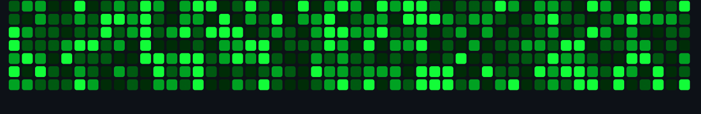

  

##  ༺🍃 卂乃ㄖㄩㄒ 爪乇 ツ
👨‍🎓 Current Student & CV Engineer | Data Scientist   **Peter the Great St. Petersburg Polytechnic University**   4th Year, Bachelor's Program  I am currently pursuing my Bachelor's degree in Computer Science at Peter the Great St. Petersburg Polytechnic University, specializing in **Computer Vision (CV)** and **Data Science**. Alongside my studies, I work as a **CV Engineer** and **Data Scientist**, where I apply my knowledge and skills to tackle real-world challenges and contribute to innovative projects.

### 🌐 Socials:
 

### 💻 Tech Stack:
                     
### 📊 GitHub Stats:
 
 

### 👀 Visitors:

